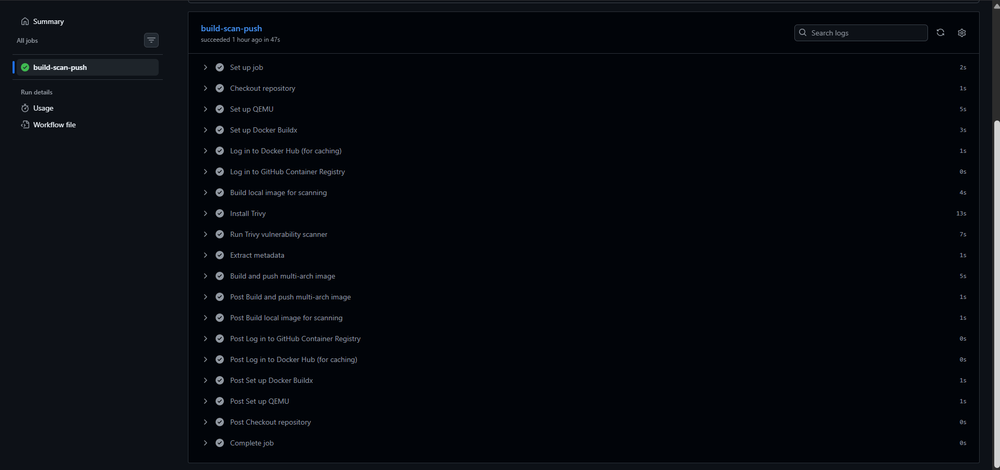
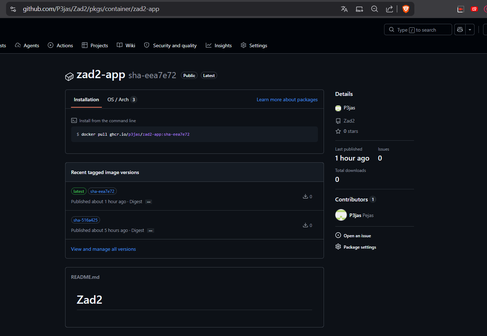
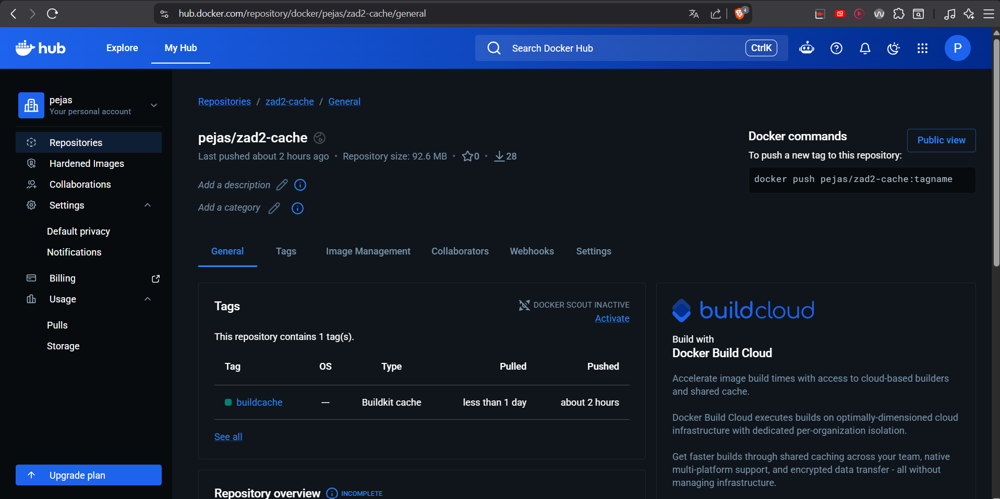

## ZADANIE 2
Kacper Kozlinski
101603


## Konfiguracja i Etapy Realizacji Łańcucha GHAction


QEMU

By moc zbudowac obraz dla dwoch architektur uzylem Docker Buildix oraz QEMU. Pierwsze pozwala budowac i eksportowac obraz multi-arch w jednym kroku a QEMU emuluje inna architekture procesora co pozwala nam zbudowac obraz ktory wspiera inna architekyure od tej na ktorej dziala w naszym przypadku linux/amd64 i linux/arm64


CACHE

Cache warstw eksportowany jesy do repo na DockerHub za pomoca `registry` w trybie `mode=max` by zapisac warstwy wszystkich etapow a nie tylko finalnego. Ponadto oznaczylem go stalym tagiem `buildcache` dzieki temu pipeline koztsta z wczesniej zbydowanych warstw


TRIVY

Wybralem ze wzgledu na to ze jest prostszy i nie wymaga konfiguracji z kontem jak Docker Scout, jak i dlatego ze ma mozliwosc za pomoca jednego parametru zablokowac process a to jeest wymagane w zadaniu. Dziala on w ten sposob ze przy wykryciu podatnosci CRITICAL lub HIGH uniemozliwia wyslanie obrazu.


PUSH

Obraz wysylany jest do publicznego repo ghcr.io tylko gdzy przejdzie skanowanie CVE


## SCHEMAT TAGOWANIA

*Obrazy*
Obrazy wysylane do rejestru dostaja 2 tagi.

latest - ktory dostaje automatycznie po kompilacji z glaezi glownej 'main'

przykladowo 'sha-1234567' - krotki skrot commita jest on unikalny

*Cache*

buildcache - jest to staly tag dla warstw cache Buildx

## Inne

W ustawieniach repozytorium zdefiniowalem zmienne DOCKERHUB_USERNAME oraz DOCKERHUB_TOKEN. Umożliwia to łańcuchowi bezpieczne logowanie do Docker Huba i obsługę cache'u bez ujawniania haseł w publicznym kodzie.
Jesli chodzi o GITHUB_TOKEN jest on dostarczany automatycznie


##Potwierdzenie dzialania
Obraz dostepny jest pod adresem
`ghcr.io/P3jas/zad2-app:latest`

Link do dockerhuba
https://hub.docker.com/r/pejas/zad2-cache

Dla potwierdzenia jeszcze dolaczam screeny z powyzszego adressu, zakladki Actions oraz z dockerHuba "adress.png", "actions.png" oraz "dockerhub.png", znajduja sie one w folderze screenshots/ dodatkowo ponizej wstawiam logi z pozytywnego "Run Trivy vulnerability scanner"

### GitHub Actions


### Obraz w ghcr.io


### Cache w DockerHub


<details>
<summary>Run Trivy vulnerability scanner</summary>

```bash
Run trivy image \
2026-05-30T16:17:12Z	WARN	'--vuln-type' is deprecated. Use '--pkg-types' instead.
2026-05-30T16:17:12Z	INFO	[vulndb] Need to update DB
2026-05-30T16:17:12Z	INFO	[vulndb] Downloading vulnerability DB...
2026-05-30T16:17:12Z	INFO	[vulndb] Downloading artifact...	repo="mcr.microsoft.com/oss/v2/aquasecurity/trivy-db:2"
60.52 MiB / 94.49 MiB [--------------------------------------->_____________________] 64.05% ? p/s ?94.49 MiB / 94.49 MiB [----------------------------------------------------------->] 100.00% ? p/s ?94.49 MiB / 94.49 MiB [----------------------------------------------------------->] 100.00% ? p/s ?94.49 MiB / 94.49 MiB [---------------------------------------------->] 100.00% 56.57 MiB p/s ETA 0s94.49 MiB / 94.49 MiB [---------------------------------------------->] 100.00% 56.57 MiB p/s ETA 0s94.49 MiB / 94.49 MiB [---------------------------------------------->] 100.00% 56.57 MiB p/s ETA 0s94.49 MiB / 94.49 MiB [---------------------------------------------->] 100.00% 52.92 MiB p/s ETA 0s94.49 MiB / 94.49 MiB [---------------------------------------------->] 100.00% 52.92 MiB p/s ETA 0s94.49 MiB / 94.49 MiB [---------------------------------------------->] 100.00% 52.92 MiB p/s ETA 0s94.49 MiB / 94.49 MiB [---------------------------------------------->] 100.00% 49.51 MiB p/s ETA 0s94.49 MiB / 94.49 MiB [---------------------------------------------->] 100.00% 49.51 MiB p/s ETA 0s94.49 MiB / 94.49 MiB [---------------------------------------------->] 100.00% 49.51 MiB p/s ETA 0s94.49 MiB / 94.49 MiB [---------------------------------------------->] 100.00% 46.31 MiB p/s ETA 0s94.49 MiB / 94.49 MiB [---------------------------------------------->] 100.00% 46.31 MiB p/s ETA 0s94.49 MiB / 94.49 MiB [---------------------------------------------->] 100.00% 46.31 MiB p/s ETA 0s94.49 MiB / 94.49 MiB [-------------------------------------------------] 100.00% 33.57 MiB p/s 3.0s2026-05-30T16:17:15Z	INFO	[vulndb] Artifact successfully downloaded	repo="mcr.microsoft.com/oss/v2/aquasecurity/trivy-db:2"
2026-05-30T16:17:15Z	INFO	[vuln] Vulnerability scanning is enabled
2026-05-30T16:17:15Z	INFO	[secret] Secret scanning is enabled
2026-05-30T16:17:15Z	INFO	[secret] If your scanning is slow, please try '--scanners vuln' to disable secret scanning
2026-05-30T16:17:15Z	INFO	[secret] Please see https://trivy.dev/docs/v0.70/guide/scanner/secret#recommendation for faster secret detection
2026-05-30T16:17:19Z	INFO	[python] Licenses acquired from one or more METADATA files may be subject to additional terms. Use `--debug` flag to see all affected packages.
2026-05-30T16:17:19Z	INFO	Detected OS	family="alpine" version="3.23.4"
2026-05-30T16:17:19Z	INFO	[alpine] Detecting vulnerabilities...	os_version="3.23" repository="3.23" pkg_num=38
2026-05-30T16:17:19Z	INFO	Number of language-specific files	num=1
2026-05-30T16:17:19Z	INFO	[python-pkg] Detecting vulnerabilities...

Report Summary

┌──────────────────────────────────────────────────────────────────────────────────┬────────────┬─────────────────┬─────────┐
│                                      Target                                      │    Type    │ Vulnerabilities │ Secrets │
├──────────────────────────────────────────────────────────────────────────────────┼────────────┼─────────────────┼─────────┤
│ local-test-image:latest (alpine 3.23.4)                                          │   alpine   │        0        │    -    │
├──────────────────────────────────────────────────────────────────────────────────┼────────────┼─────────────────┼─────────┤
│ root/.local/lib/python3.11/site-packages/blinker-1.9.0.dist-info/METADATA        │ python-pkg │        0        │    -    │
├──────────────────────────────────────────────────────────────────────────────────┼────────────┼─────────────────┼─────────┤
│ root/.local/lib/python3.11/site-packages/certifi-2026.5.20.dist-info/METADATA    │ python-pkg │        0        │    -    │
├──────────────────────────────────────────────────────────────────────────────────┼────────────┼─────────────────┼─────────┤
│ root/.local/lib/python3.11/site-packages/charset_normalizer-3.4.7.dist-info/MET- │ python-pkg │        0        │    -    │
│ ADATA                                                                            │            │                 │         │
├──────────────────────────────────────────────────────────────────────────────────┼────────────┼─────────────────┼─────────┤
│ root/.local/lib/python3.11/site-packages/click-8.4.1.dist-info/METADATA          │ python-pkg │        0        │    -    │
├──────────────────────────────────────────────────────────────────────────────────┼────────────┼─────────────────┼─────────┤
│ root/.local/lib/python3.11/site-packages/flask-3.1.3.dist-info/METADATA          │ python-pkg │        0        │    -    │
├──────────────────────────────────────────────────────────────────────────────────┼────────────┼─────────────────┼─────────┤
│ root/.local/lib/python3.11/site-packages/idna-3.17.dist-info/METADATA            │ python-pkg │        0        │    -    │
├──────────────────────────────────────────────────────────────────────────────────┼────────────┼─────────────────┼─────────┤
│ root/.local/lib/python3.11/site-packages/itsdangerous-2.2.0.dist-info/METADATA   │ python-pkg │        0        │    -    │
├──────────────────────────────────────────────────────────────────────────────────┼────────────┼─────────────────┼─────────┤
│ root/.local/lib/python3.11/site-packages/jinja2-3.1.6.dist-info/METADATA         │ python-pkg │        0        │    -    │
├──────────────────────────────────────────────────────────────────────────────────┼────────────┼─────────────────┼─────────┤
│ root/.local/lib/python3.11/site-packages/markupsafe-3.0.3.dist-info/METADATA     │ python-pkg │        0        │    -    │
├──────────────────────────────────────────────────────────────────────────────────┼────────────┼─────────────────┼─────────┤
│ root/.local/lib/python3.11/site-packages/requests-2.34.2.dist-info/METADATA      │ python-pkg │        0        │    -    │
├──────────────────────────────────────────────────────────────────────────────────┼────────────┼─────────────────┼─────────┤
│ root/.local/lib/python3.11/site-packages/urllib3-2.7.0.dist-info/METADATA        │ python-pkg │        0        │    -    │
├──────────────────────────────────────────────────────────────────────────────────┼────────────┼─────────────────┼─────────┤
│ root/.local/lib/python3.11/site-packages/werkzeug-3.1.8.dist-info/METADATA       │ python-pkg │        0        │    -    │
├──────────────────────────────────────────────────────────────────────────────────┼────────────┼─────────────────┼─────────┤
│ usr/local/lib/python3.11/site-packages/backports.tarfile-1.2.0.dist-info/METADA- │ python-pkg │        0        │    -    │
│ TA                                                                               │            │                 │         │
├──────────────────────────────────────────────────────────────────────────────────┼────────────┼─────────────────┼─────────┤
│ usr/local/lib/python3.11/site-packages/jaraco_context-6.1.2.dist-info/METADATA   │ python-pkg │        0        │    -    │
├──────────────────────────────────────────────────────────────────────────────────┼────────────┼─────────────────┼─────────┤
│ usr/local/lib/python3.11/site-packages/packaging-26.2.dist-info/METADATA         │ python-pkg │        0        │    -    │
├──────────────────────────────────────────────────────────────────────────────────┼────────────┼─────────────────┼─────────┤
│ usr/local/lib/python3.11/site-packages/pip-26.1.1.dist-info/METADATA             │ python-pkg │        0        │    -    │
├──────────────────────────────────────────────────────────────────────────────────┼────────────┼─────────────────┼─────────┤
│ usr/local/lib/python3.11/site-packages/setuptools-82.0.1.dist-info/METADATA      │ python-pkg │        0        │    -    │
├───────────────────────────────────────────────��──────────────────────────────────┼────────────┼─────────────────┼─────────┤
│ usr/local/lib/python3.11/site-packages/setuptools/_vendor/autocommand-2.2.2.dis- │ python-pkg │        0        │    -    │
│ t-info/METADATA                                                                  │            │                 │         │
├──────────────────────────────────────────────────────────────────────────────────┼────────────┼─────────────────┼─────────┤
│ usr/local/lib/python3.11/site-packages/setuptools/_vendor/backports.tarfile-1.2- │ python-pkg │        0        │    -    │
│ .0.dist-info/METADATA                                                            │            │                 │         │
├──────────────────────────────────────────────────────────────────────────────────┼────────────┼─────────────────┼─────────┤
│ usr/local/lib/python3.11/site-packages/setuptools/_vendor/importlib_metadata-8.- │ python-pkg │        0        │    -    │
│ 7.1.dist-info/METADATA                                                           │            │                 │         │
├──────────────────────────────────────────────────────────────────────────────────┼────────────┼─────────────────┼─────────┤
│ usr/local/lib/python3.11/site-packages/setuptools/_vendor/jaraco.text-4.0.0.dis- │ python-pkg │        0        │    -    │
│ t-info/METADATA                                                                  │            │                 │         │
├──────────────────────────────────────────────────────────────────────────────────┼────────────┼─────────────────┼─────────┤
│ usr/local/lib/python3.11/site-packages/setuptools/_vendor/jaraco_context-6.1.0.- │ python-pkg │        0        │    -    │
│ dist-info/METADATA                                                               │            │                 │         │
├──────────────────────────────────────────────────────────────────────────────────┼────────────┼─────────────────┼─────────┤
│ usr/local/lib/python3.11/site-packages/setuptools/_vendor/jaraco_functools-4.4.- │ python-pkg │        0        │    -    │
│ 0.dist-info/METADATA                                                             │            │                 │         │
├──────────────────────────────────────────────────────────────────────────────────┼────────────┼─────────────────┼─────────┤
│ usr/local/lib/python3.11/site-packages/setuptools/_vendor/more_itertools-10.8.0- │ python-pkg │        0        │    -    │
│ .dist-info/METADATA                                                              │            │                 │         │
├──────────────────────────────────────────────────────────────────────────────────┼────────────┼─────────────────┼─────────┤
│ usr/local/lib/python3.11/site-packages/setuptools/_vendor/packaging-26.0.dist-i- │ python-pkg │        0        │    -    │
│ nfo/METADATA                                                                     │            │                 │         │
├──────────────────────────────────────────────────────────────────────────────────┼────────────┼─────────────────┼─────────┤
│ usr/local/lib/python3.11/site-packages/setuptools/_vendor/platformdirs-4.4.0.di- │ python-pkg │        0        │    -    │
│ st-info/METADATA                                                                 │            │                 │         │
├──────────────────────────────────────────────────────────────────────────────────┼────────────┼─────────────────┼─────────┤
│ usr/local/lib/python3.11/site-packages/setuptools/_vendor/tomli-2.4.0.dist-info- │ python-pkg │        0        │    -    │
│ /METADATA                                                                        │            │                 │         │
├──────────────────────────────────────────────────────────────────────────────────┼────────────┼─────────────────┼─────────┤
│ usr/local/lib/python3.11/site-packages/setuptools/_vendor/wheel-0.46.3.dist-inf- │ python-pkg │        0        │    -    │
│ o/METADATA                                                                       │            │                 │         │
├──────────────────────────────────────────────────────────────────────────────────┼────────────┼─────────────────┼─────────┤
│ usr/local/lib/python3.11/site-packages/setuptools/_vendor/zipp-3.23.0.dist-info- │ python-pkg │        0        │    -    │
│ /METADATA                                                                        │            │                 │         │
├──────────────────────────────────────────────────────────────────────────────────┼────────────┼─────────────────┼─────────┤
│ usr/local/lib/python3.11/site-packages/wheel-0.47.0.dist-info/METADATA           │ python-pkg │        0        │    -    │
└──────────────────────────────────────────────────────────────────────────────────┴────────────┴─────────────────┴─────────┘
Legend:
- '-': Not scanned
- '0': Clean (no security findings detected)

```
</details>
